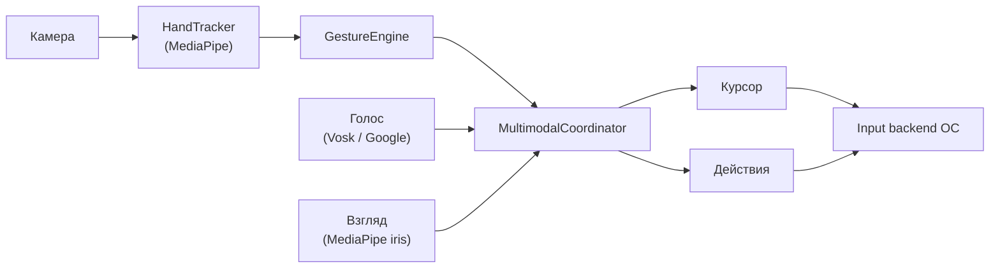

<p align="center">
  
</p>

<h1 align="center">AirControl</h1>

<p align="center">
  <b>Управление компьютером без мыши — для людей с ограниченной моторикой.</b><br>
  Рука, взгляд, голос и dwell-click в одной программе. Без специального оборудования — достаточно веб-камеры.
</p>

<p align="center">
  <a href="https://github.com/fakedesyncc/AirControl-MK/releases/latest">
    
  </a>
</p>

<p align="center">
  <a href="https://github.com/fakedesyncc/AirControl-MK/actions/workflows/build.yml">
    
  </a>
  <a href="https://github.com/fakedesyncc/AirControl-MK/actions/workflows/ci.yml">
    
  </a>
  
  
  
  
  
</p>

<p align="center">
  <a href="#быстрый-старт"><b>Быстрый старт</b></a>
  &nbsp;·&nbsp;
  <a href="#для-кого">Для кого</a>
  &nbsp;·&nbsp;
  <a href="#жесты">Жесты</a>
  &nbsp;·&nbsp;
  <a href="#чем-отличается">Чем отличается</a>
  &nbsp;·&nbsp;
  <a href="docs/ARCHITECTURE.md">Архитектура</a>
</p>

---

## Почему Это Важно

Обычная мышь требует точного наведения, щелчка, удержания и мелкой моторики.
Для людей с тремором, травмой, RSI, слабостью кисти или малым диапазоном
движения это может быть главным барьером перед компьютером.

AirControl строится вокруг другой идеи: дать человеку несколько способов
управления на выбор и не требовать консоль, специальное устройство или точный
жест. Наведение рукой можно усилить dwell-click, голосом, взглядом и экранной
сканирующей клавиатурой.

## Что Делает AirControl

AirControl видит руку через веб-камеру, переводит движения в курсор, распознаёт
жесты и включает безопасные режимы настройки, где реальные клики и нажатия не
отправляются в операционную систему. Готовая сборка запускается двойным кликом и
не требует установленного Python.

## Готовность Проекта

| Направление        | Что уже есть                                                                  |
| ------------------ | ----------------------------------------------------------------------------- |
| Первый запуск      | мастер проверки камеры, модели руки и input backend без консоли              |
| Безопасность       | `View`/`Safe` режимы, preflight перед управлением, отчёт диагностики ZIP      |
| Доступность        | dwell-click, one-gesture mode, пресеты `steady` и `low_motion`, клавиатура    |
| Приватность        | локальная обработка видео и офлайн-голос через Vosk без скрытого fallback     |
| Кросс-платформенно | Windows, macOS и Linux сборки через CI, отдельные подсказки для Linux backend |
| Проверяемость      | юнит-тесты, compileall, Go helper tests, smoke-проверки релизных артефактов   |

## Ключевые Возможности

- **Курсор рукой + dwell-click** — наведение по положению кисти и клик по
  удержанию, с профилями `fast` / `normal` / `steady` и паузой от повторных кликов.
- **Ассистивные пресеты** — `balanced`, `steady`, `low_motion` под тремор,
  малый диапазон движения и аккуратное управление.
- **Динамические свайпы** — эвристика или обучаемые временные модели (TCN/LSTM);
  рантайм работает на numpy, torch в сборку не входит.
- **Наведение взглядом** (опционально) — грубый указатель по MediaPipe iris в
  режимах `assist` (рука уточняет) и `cursor`.
- **Офлайн-голос** — приватное распознавание команд через локальную модель Vosk,
  без отправки речи в интернет.
- **Сканирующая клавиатура** — ввод текста через один выбор: подходит, когда
  трудно точно наводить курсор или делать щипок.
- **Безопасные режимы** — `View` / `Safe` показывают руку и жесты, но не шлют
  ввод в ОС, пока вы не включите `Control` после preflight.
- **Кросс-платформенные установщики** — сборки для Windows, macOS и Linux через
  GitHub Actions, плюс встроенная диагностика без консоли.

## Для Кого

| Сценарий                                | Что даёт AirControl                                                       |
| --------------------------------------- | ------------------------------------------------------------------------- |
| Сложно пользоваться мышью               | Dwell-click, крупное стартовое окно, калибровка движения                  |
| Есть тремор или непроизвольные движения | Пресет `steady`: больше удержание, сильнее сглаживание, пауза после клика |
| Рука двигается в малом диапазоне        | Пресет `low_motion`: меньшая активная зона и усиление движения            |
| Недоступны щипки и точное наведение     | Сканирующая клавиатура и режим одного жеста                               |
| Нужна безопасная настройка              | Режим просмотра и тренировки без реального ввода                          |
| Тестирование на чужом ПК                | Встроенный `doctor` и ZIP-отчёт диагностики                               |
| Linux с проблемами ввода                | Проверка backend, Xorg/Wayland подсказки, `xdotool`/`ydotool` fallback    |

## Чем Отличается

AirControl не пытается заменить медицинский eye-tracker или профессиональные
голосовые системы. Его сильная сторона — объединить несколько доступных
модальностей в одном webcam-only приложении и дать пользователю безопасный путь
от проверки камеры до реального управления.

| Подход                    | Обычно хорошо получается          | Что добавляет AirControl                                     |
| ------------------------- | --------------------------------- | ------------------------------------------------------------ |
| Управление только рукой   | жесты и курсор                    | dwell-click, one-gesture mode, пресеты под тремор            |
| Управление только взглядом | наведение при наличии eye-tracker | грубый webcam gaze как вспомогательный сигнал, без железа    |
| Управление только голосом | команды и диктовка                | локальный Vosk и совместная работа с рукой/взглядом          |
| Клавиатуры AAC            | ввод одним выбором                | встроенная сканирующая клавиатура рядом с жестовым курсором  |
| Демо-прототипы            | показать идею                     | установщики, диагностика, first-run wizard, release-проверки |

## Как Это Работает

Камера отдаёт кадры трекеру руки, движок жестов превращает позы кисти в события,
а мультимодальный координатор объединяет руку, голос и взгляд и решает, что
именно отправить в курсор и действия. Реальный ввод уходит в ОС только в режиме
`Control` через изолированный input backend.



Подробный разбор модулей и границ ответственности — в
[docs/ARCHITECTURE.md](docs/ARCHITECTURE.md).

## Полный Список Возможностей

- движение курсора по положению руки;
- левый/правый клик жестами;
- dwell-click: клик по удержанию курсора с профилями `fast`/`normal`/`steady`
  и паузой после клика от повторных срабатываний;
- режим одного жеста: наведение + dwell-click без щипков, скролла и zoom;
- экранная сканирующая клавиатура для ввода текста одним «выбором»;
- ассистивные пресеты `balanced`, `steady`, `low_motion` под разные возможности руки;
- динамические свайпы: эвристика или обучаемые временные модели (TCN/LSTM) без torch в сборке;
- опциональное наведение взглядом (MediaPipe iris): режимы `assist` (рука уточняет) и `cursor`;
- безопасный `View`/`Safe` режим без отправки кликов и клавиш;
- ассистивный профиль для слабых ноутбуков и аккуратного управления;
- калибровка активной зоны руки и порогов щипка;
- диагностика камеры, модели, прав ОС и input backend;
- опциональный офлайн-голос через Vosk без отправки речи в интернет;
- нативная диагностика ОС через Go helper в релизном бандле;
- ZIP-отчёт поддержки для разработчика или помощника;
- сборки для Windows, macOS и Linux через GitHub Actions.

## Быстрый Старт

Готовые сборки публикуются на странице релизов:
**[github.com/fakedesyncc/AirControl-MK/releases/latest](https://github.com/fakedesyncc/AirControl-MK/releases/latest)**.
Выберите артефакт под свою ОС:

| ОС            | Файл                               | Для кого                                  |
| ------------- | ---------------------------------- | ----------------------------------------- |
| Windows       | `AirControl-Setup.exe`             | обычная установка без прав администратора |
| Windows       | `AirControl-Windows.zip`           | portable-проверка                         |
| macOS         | `AirControl-macOS.zip`             | `.app`-сборка                             |
| Debian/Ubuntu | `AirControl-Linux-amd64.deb`       | установка через графический установщик    |
| Linux         | `AirControl-Linux-x86_64.AppImage` | portable-запуск двойным кликом            |
| Linux         | `AirControl-Linux.tar.gz`          | ручная диагностика                        |

> Сборки пока не подписаны: Windows SmartScreen и macOS Gatekeeper могут
> попросить ручное подтверждение запуска.

## Развитие

Проект развивается вокруг ассистивного сценария: безопасный первый запуск,
управление без точной моторики, понятная диагностика и установщики для обычного
пользователя. Текущие этапы и release gate описаны в [ROADMAP.md](ROADMAP.md).

Документы для сопровождения проекта:

- [docs/ARCHITECTURE.md](docs/ARCHITECTURE.md) — архитектура и границы модулей;
- [docs/RESEARCH.md](docs/RESEARCH.md) — методика экспериментов и оценки;
- [BUILD.md](BUILD.md) — сборка и проверка релизных артефактов;
- [docs/NATIVE_HELPER.md](docs/NATIVE_HELPER.md) — зачем нужен Go helper.

## Первый Запуск

1. Запустите AirControl.
2. Выберите `Безопасная тренировка` или `Просмотр камеры`.
3. Убедитесь, что камера видит руку и FPS стабильный.
4. Откройте `Калибровка под пользователя`.
5. После настройки включите `Ассистивное управление`.

В безопасных режимах приложение показывает руку и жесты, но не отправляет
клики, клавиши и движение мыши в операционную систему.

## Стартовое Окно

| Кнопка                                      | Назначение                                                                  |
| ------------------------------------------- | --------------------------------------------------------------------------- |
| Мастер первого запуска                      | пошагово проверяет камеру, input backend и следующий безопасный шаг         |
| Безопасная тренировка                       | жесты и камера работают, ввод в ОС отключён                                 |
| Ассистивное управление: баланс              | перед запуском проверяет input backend, затем включает курсор и dwell-click |
| Ассистивное управление: тремор / дрожание   | более плавный курсор, дольше dwell-click, больше пауза после клика          |
| Ассистивное управление: мало движения рукой | меньшая активная зона, чтобы достать края экрана небольшим движением        |
| Калибровка под пользователя                 | настройка активной зоны и щипка                                             |
| Проверить систему                           | диагностика без терминала                                                   |
| Сохранить отчёт диагностики                 | ZIP для разбора проблем                                                     |
| Просмотр камеры                             | безопасная проверка распознавания руки                                      |

## Статусы Ввода

| Статус        | Значение                                                              |
| ------------- | --------------------------------------------------------------------- |
| `VIEW`        | безопасный просмотр, реальные действия отключены                      |
| `CONTROL`     | управление включено                                                   |
| `SAFE`        | ввод отключён вручную                                                 |
| `INPUT RISK`  | ОС или Linux-сессия может блокировать глобальный ввод                 |
| `INPUT ERROR` | жест распознан, но backend не смог выполнить действие                 |
| `One ON`      | включён режим одного жеста: щипки и сложные жесты намеренно отключены |
| `Low FPS`     | приложение снижает нагрузку на слабом ПК                              |

Если камера видит руку, но курсор не двигается, сначала сохраните ZIP-отчёт
через стартовое окно. Чаще всего причина в правах ОС, Wayland или input backend,
а не в распознавании жеста.

Для первого запуска используйте `Мастер первого запуска`: он проверит камеру,
модель руки, backend ввода ОС и подскажет, можно ли переходить к безопасной
тренировке или нужно сохранить ZIP-отчёт.

Перед реальным `Ассистивным управлением` AirControl выполняет безопасный
preflight: проверяет backend ввода и, где возможно, двигает курсор на 1 px без
кликов. Если ОС блокирует ввод, приложение предложит открыть диагностику вместо
тихого запуска режима, который не сможет нажимать кнопки.

## Linux

На Linux камера и распознавание могут работать, но глобальный ввод иногда
блокируется окружением рабочего стола.

Рекомендации:

- для Debian/Ubuntu установите `libgl1`, `libglib2.0-0`, `xdotool`;
- если используется Wayland и клики не проходят, проверьте Xorg-сессию;
- для Wayland можно настроить `ydotoold` с доступом к `/dev/uinput`;
- если камера недоступна, добавьте пользователя в группу `video` и перелогиньтесь;
- используйте кнопку `Проверить ввод мыши`: она двигает курсор на 1 px и не
  кликает.

## Жесты

| Жест                    | Действие                                                        |
| ----------------------- | --------------------------------------------------------------- |
| Большой + указательный  | левый клик или перетаскивание                                   |
| Большой + средний       | правый клик                                                     |
| Большой + безымянный    | Backspace                                                       |
| Большой + мизинец       | Enter                                                           |
| Два быстрых щипка       | альтернативное действие                                         |
| Открытая ладонь         | пауза курсора                                                   |
| Открытая ладонь + взмах | свайп влево/вправо/вверх/вниз (динамический жест)               |
| Жест `мир` + движение   | прокрутка                                                       |
| Кулак                   | голосовая команда                                               |
| Две руки щипком         | zoom, если включён двуручный режим                              |
| Взгляд (опционально)    | грубое наведение курсора: `assist` (рука уточняет) или `cursor` |

Если человеку сложно делать щипок, используйте ассистивный профиль с
dwell-click и кнопкой `One ON`. В этом режиме AirControl не выполняет действия
по щипкам, скроллу, голосовому жесту и двуручному zoom: остаются наведение,
dwell-click и пауза открытой ладонью. В окне управления можно переключать
профиль удержания: `fast` для быстрого клика, `normal` для обычной работы,
`steady` для медленного уверенного клика с большей зоной удержания и более
длинной паузой от повторного клика.

## Ассистивные Пресеты

| Пресет       | Для кого                                | Что меняется                                                                 |
| ------------ | --------------------------------------- | ---------------------------------------------------------------------------- |
| `balanced`   | базовое ассистивное управление          | dwell `normal`, one-gesture, умеренное сглаживание                           |
| `steady`     | тремор, дрожание, риск случайных кликов | dwell `steady`, ниже чувствительность, сильнее сглаживание, длиннее cooldown |
| `low_motion` | небольшой диапазон движения кисти       | меньшая активная зона и выше чувствительность                                |

## Горячие Клавиши

Работают в английской и русской раскладке. Если фокус потерян, кликните по окну
камеры.

| Клавиша     | Действие              |
| ----------- | --------------------- |
| `1` / `2`   | просмотр / управление |
| `+` / `-`   | чувствительность      |
| `f` / `а`   | фильтр курсора        |
| `g` / `п`   | эвристика / ML        |
| `d` / `в`   | dwell-click           |
| `o` / `щ`   | режим одного жеста    |
| `l` / `д`   | скелет руки           |
| `h` / `р`   | HUD                   |
| `F2` / `F3` | тест Фиттса           |
| `Esc`       | выход                 |

## Разработка

```bash
python3 -m venv venv
source venv/bin/activate
pip install -e .
python -m aircontrol
```

Windows:

```powershell
python -m venv venv
venv\Scripts\activate
pip install -e .
python -m aircontrol
```

Проверки:

```bash
python -m compileall aircontrol tests tools packaging/pyinstaller_hooks run_app.py
python -m unittest discover -s tests
python -m aircontrol doctor --no-camera
python -m aircontrol selftest
```

Нативный diagnostic helper собирается Go-компилятором и нужен для release-бандла,
но не обязателен для обычного запуска из исходников:

```bash
go test ./cmd/aircontrol-helper
mkdir -p bin
go build -trimpath -ldflags="-s -w" -o bin/aircontrol-helper ./cmd/aircontrol-helper
```

Optional-зависимости для исследовательских команд, расширенного ML и офлайн
голоса находятся в `requirements-optional.txt`.

Пакетная metadata описана в `pyproject.toml`, поэтому проект можно ставить в
editable-режиме и запускать через `aircontrol`. Файлы `requirements*.txt`
оставлены для CI, PyInstaller и пользователей, которым удобнее явные списки
зависимостей.

### Офлайн-Голос

По умолчанию голосовой ввод использует `SpeechRecognition`/Google и требует
интернет. Для приватного офлайн-режима установите optional-зависимости и
распакуйте модель Vosk в каталог `aircontrol/data/vosk-model` или укажите свой
путь в `voice.vosk_model_path` в config.json:

```bash
pip install -r requirements-optional.txt
python -m tools.setup_vosk
python -m aircontrol doctor --no-camera
```

Если `voice.engine` установлен в `vosk`, AirControl не делает fallback в Google:
без локальной модели голос просто будет недоступен, а жесты и dwell-click
останутся рабочими.

### Наведение Взглядом (опционально)

Взгляд — экспериментальная ассистивная модальность. Включается флагом
`--gaze-mode assist` (рука уточняет взгляд) или `--gaze-mode cursor` (взгляд ведёт
курсор, когда руки нет в кадре). Нужна модель `face_landmarker.task` рядом с
проектом или по пути `fusion.gaze.model_path`; без неё приложение тихо остаётся в
режиме «только рука». Без аппаратного eye-tracker оценка взгляда грубая — это
вспомогательное наведение, а не точный указатель.

```bash
python -m aircontrol run --gaze-mode assist
```

### Динамические Свайпы Через Временные Модели

Свайпы по умолчанию распознаются эвристикой. Для исследовательской части можно
обучить и подключить временную модель (TCN/LSTM), при этом сам рантайм остаётся
на numpy без torch в сборке:

```bash
python tools/train_swipe_model.py --backend tcn --epochs 80
# затем в config.json → gestures: "swipe_backend": "tcn", "swipe_model_path": "<.npz>"
```

Подробнее — [docs/RESEARCH.md](docs/RESEARCH.md), раздел 3.3.1.

## Релиз

Подробная инструкция: [BUILD.md](BUILD.md).

Коротко:

```bash
pip install -r requirements-build.txt
pyinstaller aircontrol.spec --noconfirm
python tools/smoke_build.py
```

PyInstaller не кросс-компилирует. Полные сборки под Windows, macOS и Linux
делает workflow [Build AirControl](https://github.com/fakedesyncc/AirControl-MK/actions/workflows/build.yml).
Быстрая проверка исходников вынесена в workflow
[CI](https://github.com/fakedesyncc/AirControl-MK/actions/workflows/ci.yml).

## Лицензия

Код AirControl распространяется по лицензии [MIT](LICENSE). Сторонние
зависимости, системные утилиты и bundled model asset имеют собственные лицензии;
краткое уведомление находится в [NOTICE](NOTICE).

## Структура

```text
aircontrol/
  app.py              runtime приложения
  launcher.py         стартовое окно
  config.py           конфигурация и ассистивный профиль
  tracking/           камера, MediaPipe, фильтры
  gestures/           эвристика, ML, динамические жесты
  control/            курсор, клики, backend ввода
  platform/           Windows, macOS, Linux API
  diagnostics.py      doctor и support bundle
  ui/                 HUD и калибровка
cmd/
  aircontrol-helper/  Go helper для native diagnostics
docs/
  ARCHITECTURE.md      архитектура приложения
  RESEARCH.md          методика экспериментов и оценки
  NATIVE_HELPER.md    зачем нужен и как собирается Go helper
packaging/            PyInstaller, Linux, Windows packaging
tools/                smoke и release verification
tests/                unit-тесты
```

## Ограничения

- Сборки пока не подписаны.
- Wayland может блокировать глобальный ввод.
- Голосовые команды зависят от микрофона и выбранного backend.
- Качество управления зависит от освещения, камеры и FPS.
- Локальные конфиги, датасеты, логи, скриншоты и ZIP-отчёты не коммитятся.
