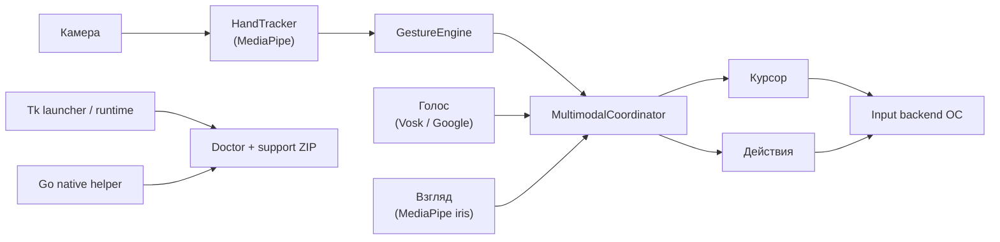

# AirControl Architecture

Этот документ описывает AirControl как инженерную систему: какие модули за что
отвечают, где проходят границы ответственности и почему проект не сводится к
одному Python-скрипту с камерой.

## Цель Системы

AirControl должен позволять человеку управлять компьютером через обычную
веб-камеру без обязательной мыши, терминала и специальных датчиков. Главные
требования:

- безопасный первый запуск без случайных кликов;
- работа из готового установщика или portable-бандла;
- диагностика проблем камеры, FPS и системного ввода без консоли;
- ассистивный режим для пользователей, которым сложно делать точные жесты;
- воспроизводимые эксперименты для оценки качества управления.

## Поток Данных

Та же схема в сжатом виде есть в [README](../README.md). Реальные события мыши и
клавиатуры уходят в input backend ОС только в режиме `Control`; в `View` и `Safe`
координатор и курсор работают, но backend не отправляет ввод.

## Основные Модули

| Модуль                  | Ответственность                                                                | Почему отделён                                       |
| ----------------------- | ------------------------------------------------------------------------------ | ---------------------------------------------------- |
| `tracking/`             | камера, MediaPipe Hand Landmarker, фильтры, опциональная оценка взгляда (iris) | можно тестировать трекинг отдельно от GUI            |
| `gestures/`             | признаки, позы, щипки, one-gesture режим, динамические свайпы                  | распознавание не исполняет действия напрямую         |
| `fusion/`               | разрешение конфликтов руки, голоса и взгляда                                   | одно место для правил приоритета                     |
| `control/`              | курсор, dwell-click, input backend                                             | ввод в ОС изолирован и диагностируется               |
| `ui/`                   | отрисовка HUD и калибровка                                                     | UI не содержит бизнес-логики ввода                   |
| `diagnostics.py`        | doctor, support ZIP, runtime summary                                           | обычный пользователь может отдать отчёт помощнику    |
| `launcher.py`           | стартовое окно, first-run wizard, preflight                                    | вход в продукт без терминала                         |
| `cmd/aircontrol-helper` | native diagnostics на Go                                                       | маленький переносимый helper без Python-зависимостей |

## Режимы Безопасности

AirControl разделяет распознавание и реальный ввод:

- `View` показывает камеру, скелет руки и позы, но не отправляет input events.
- `Safe` запускает runtime с камерой и жестами, но backend ввода работает в dry-run.
- `Control` отправляет реальные события мыши/клавиатуры только после preflight.
- `One ON` оставляет только наведение, dwell-click и паузу открытой ладонью.

Это важно для ассистивного применения: ошибка распознавания не должна сразу
становиться ошибочным кликом в операционной системе.

## Ассистивный Профиль

`apply_assistive_profile()` задаёт консервативные параметры:

- сниженная нагрузка камеры: `480x360 @ 30 FPS`;
- downscale детекции и ограничение FPS на слабых CPU;
- One-Euro фильтр с более мягкими параметрами;
- dwell-click с профилем `normal`;
- one-gesture режим по умолчанию;
- отключение динамических и двуручных жестов.

Доступны три пресета:

- `balanced` — базовое ассистивное управление;
- `steady` — для тремора и непроизвольных движений;
- `low_motion` — для малого диапазона движения кисти.

Профили dwell-click задают три величины: время удержания, допустимый радиус
дрожания и cooldown после клика. Это снижает риск повторных срабатываний.

## Кросс-Платформенный Ввод

Один и тот же gesture pipeline работает на Windows, macOS и Linux, но системный
ввод различается:

- Windows/macOS обычно используют `pynput` при наличии разрешений ОС.
- Linux/X11 может использовать `pynput` или `xdotool`.
- Linux/Wayland часто блокирует глобальный ввод; doctor явно предлагает Xorg
  или `ydotoold` с доступом к `/dev/uinput`.

Если backend недоступен, приложение не скрывает проблему: runtime показывает
`INPUT OFF`, `INPUT RISK` или `INPUT ERROR`, а support ZIP сохраняет причину.

## Голосовые Backend-Ы

Голосовая модальность опциональна: управление жестами и dwell-click не зависят
от микрофона.

- `google` — онлайн-распознавание через SpeechRecognition, требует интернет и
  FLAC-конвертер.
- `vosk` — офлайн-распознавание через локальную модель Vosk. Если модель не
  установлена, AirControl не переключается в Google скрыто: voice status и
  doctor явно показывают проблему.

## Наведение Взглядом

Взгляд — опциональная вспомогательная модальность. `tracking/gaze.py` оценивает
направление взгляда по лендмаркам радужки из MediaPipe Face Landmarker (iris) и
отображает его в координаты экрана через аффинную калибровку. Это грубый сигнал:
без аппаратного eye-tracker ошибка велика, поэтому взгляд используется как
вспомогательное наведение.

- `assist` — взгляд даёт грубую цель, рука уточняет позицию курсора.
- `cursor` — взгляд ведёт курсор, когда руки нет в кадре.

Вся математика отображения и калибровки вынесена в `gaze_math.py` без импорта
MediaPipe, что позволяет тестировать её отдельно. Без модели лица оценщик молча
отдаёт «невалидно», и приложение остаётся в режиме «только рука».

## Динамические Свайпы

Свайпы по умолчанию распознаются эвристикой. Опционально подключается обучаемая
временная модель (TCN/LSTM): рантайм `gestures/dynamic.py` выполняет только
прямой проход на numpy, поэтому torch в продуктовый бандл не входит. Веса
обучаются офлайн через `tools/train_swipe_model.py` и сохраняются в `.npz` в
формате, который ожидает рантайм; train и inference используют одни и те же
функции признаков, чтобы точность совпадала.

## Упаковка

Релиз собирается через PyInstaller на каждой целевой ОС. Go helper компилируется
в workflow перед сборкой и попадает в бандл. Проверки:

- `tools/check_tracked_sources.py` ловит ignored source-файлы до CI;
- `tools/smoke_build.py` запускает frozen executable;
- `tools/verify_release_artifacts.py` проверяет состав архивов, `.deb`,
  AppImage и Windows installer.

## Принцип Развития

Новые функции добавляются только если они улучшают реальное управление или
диагностику. Сложные жесты должны быть опциональными: базовый ассистивный путь
остаётся простым и безопасным.
